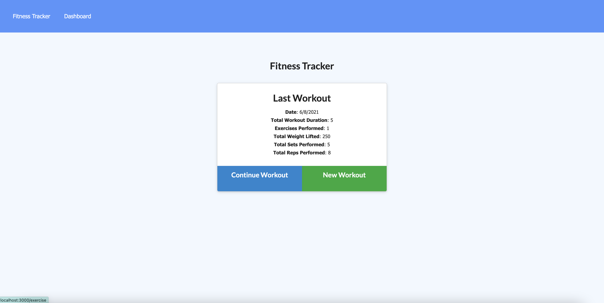
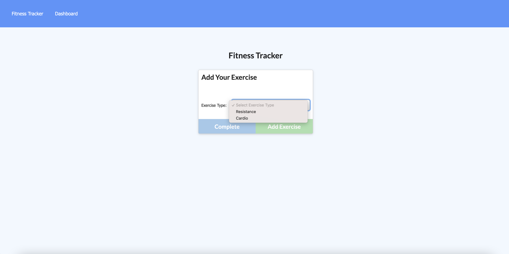
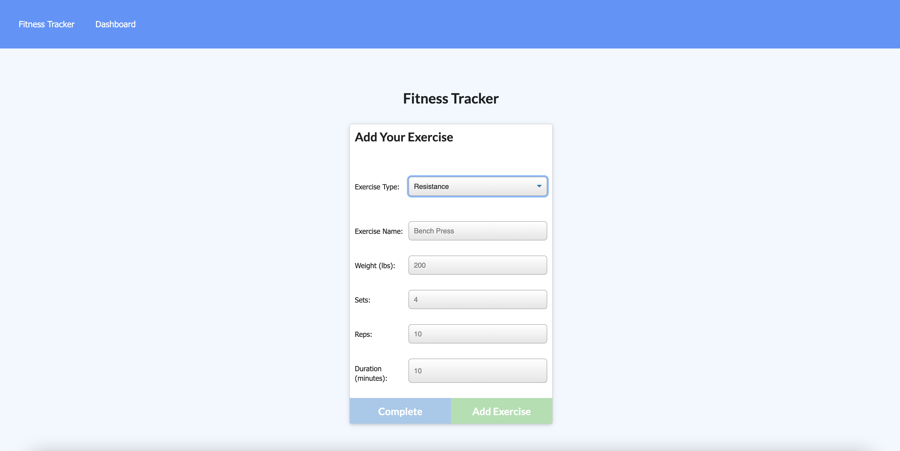
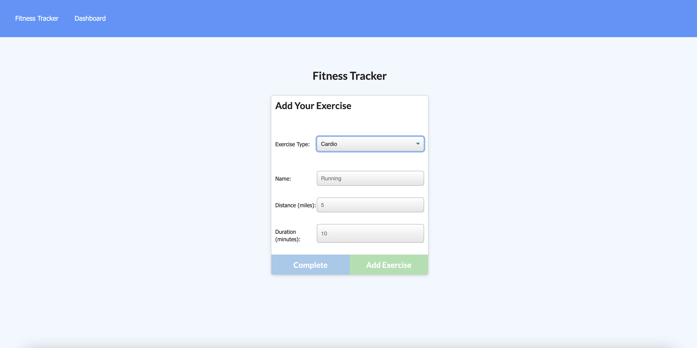

# Training_Tracker

## Introduction
The fitness tracker is a full stack app that allows the user to set up a workout routine.
The user can see their last workout from the homepage, while also allowing the user to continue that workout or start a new one.

## Installation 
To install this application you will need to do a few things
- clone repo https://github.com/spenserlogan/Training_Tracker
- install all dependent npm packages npm install --save
- create a mongoDB database
- If you're running locally update the MONGODB_URI with your connection string in a .env file
- run npm run seed
- to start the application run npm start

## Screenshots

